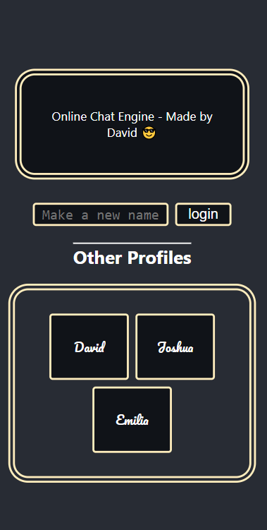
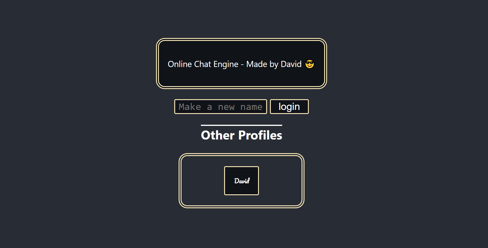
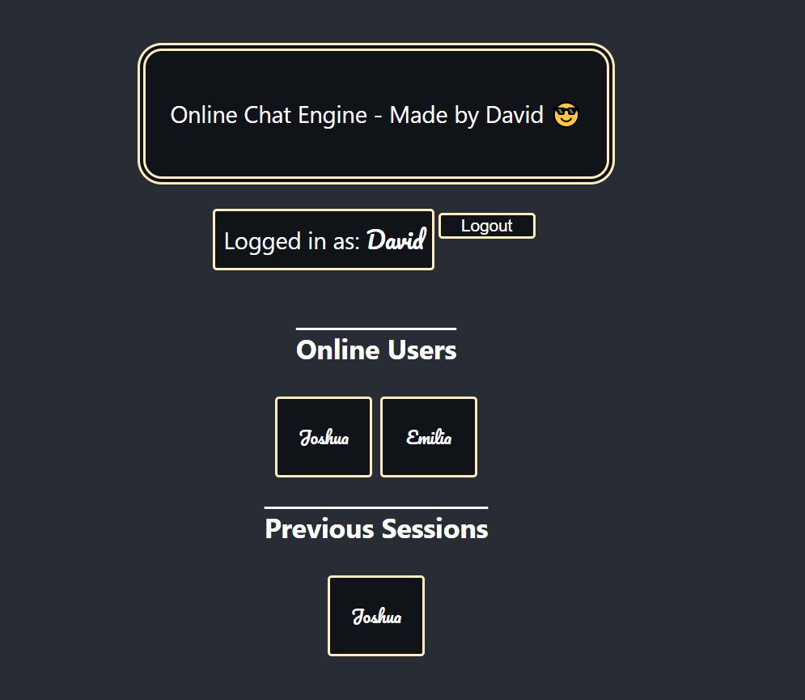
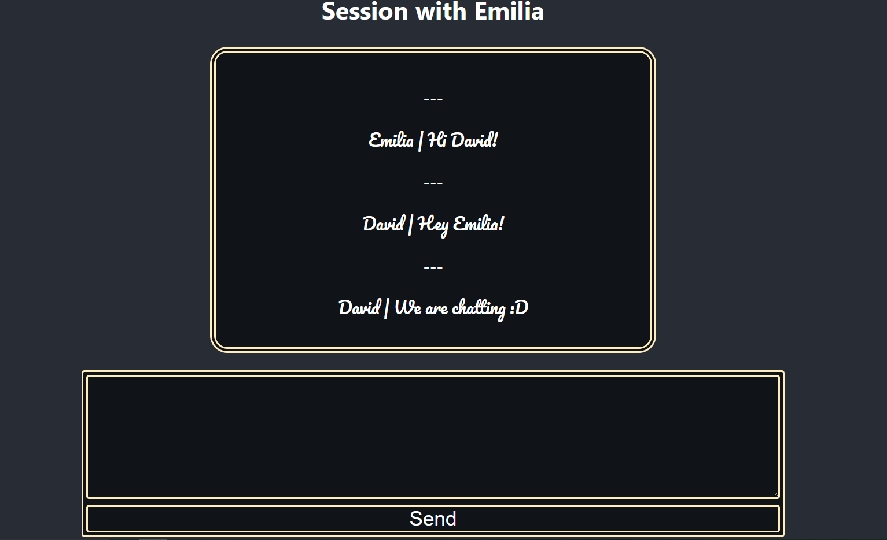
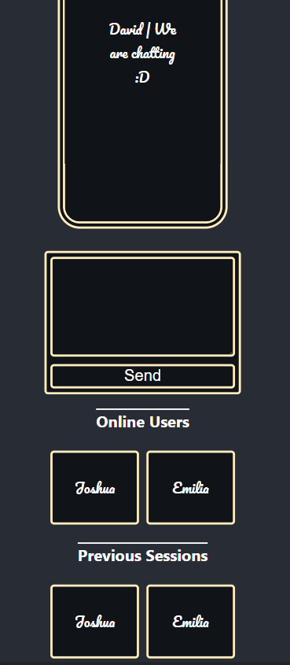

# ChatEngine-FrontEnd

## Thoughts

-   Oh boy where do i begin, what a blast of a project, the backend got my head spinning on all sorts of new stuff to learn, from how to draw a database, completing a relational database and so much more!, loved every single bit of it! Not only that but doing front end was a nice relaxing time too, helped me refine my skills in react and typescript as i previously simply used Javascript

## Inner workings

-   A person will log into either an existing account, which is displayed as a grid with the title of other profiles, clicking on that will log the person into it, which the backend will produce a identifier, more on details can be found on the backend GIT with a diagram.
    -   You also can create a new account, or if the typed user exists with the same name, can also log into that
    -   Oldest profiles are displayed first, this allows for more users to share a single account for more connections
-   Upon loading up a profile, a list of sessions aka previously messaged people can be seen listed as previous sessions.
    -   If a user would like to talk to a new person, they may click on a user under the online profiles section
-   When messaging, new messages will be automatically recieved at 1 second intervals, and with each message will automatically scroll down to the newest one while displaying who has sent i

## Previews

## Possibly other features

-   I would like to learn more on event based databases / Server sent events as this would boost performance much more on a larger scale project, for a project like this which at max will have 3 people using at once, its was able to be passed up, but on larger scaled projects with more than 20 people, this is a must, as sending out updates every second can be quite stressful on the server, and any more than 1 second can annoy users while waiting for new messages

## What i learnt

-

## Skills

-   React
-   MySQL
-   Typescript
-   Javascript
-   Following intense self applied deadlines (for the challange)
-   NestJS
-   SCSS

## Problems and my mindset

-   I had quite a problem with fetching and how it would work in typescript as i previously simply used javascript, and as such a new love for interfaces were born
-   I also pushed myself like crazy chasing up on deadlines which to be honest i quite enjoyed, because after a long intense day it felt good to know that i did my best, and could see the results to show for it 😁😁😁
-   A spent quite a while trying to learn event based databases but the complexity of it grew and my deadlines were creepying quite quickly and so i had to replace it with a interval based fetch system which unfortantely isnt what i had hoped for but will work on future projects to help learn more on this topic
